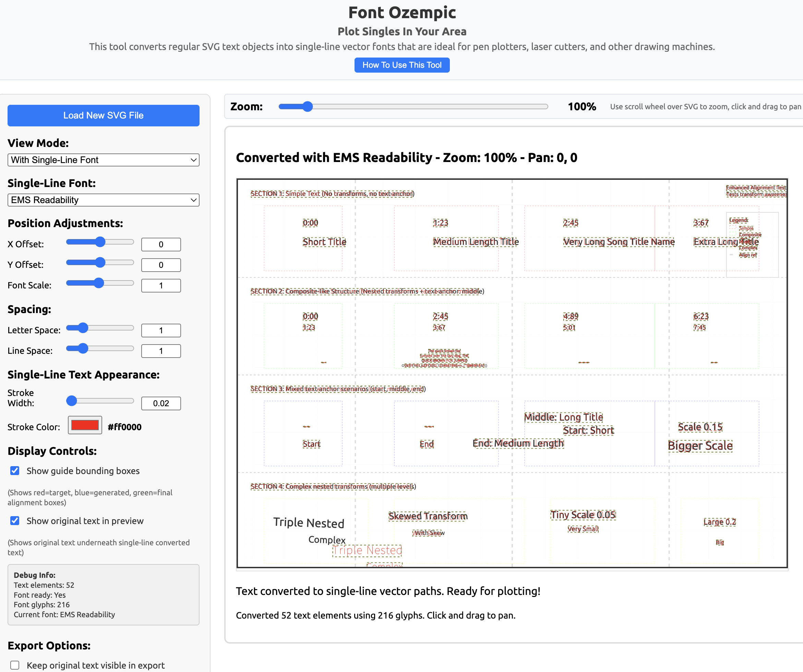

# Font Ozempic 🖋️

A web-based tool that converts SVG files containing regular fonts to single-line vector fonts suitable for plotters, laser cutters, and other digital fabrication tools.



## 🎯 What It Does

Font Ozempic takes your SVG files with regular text and converts them to use single-line vector fonts, preserving positioning, transforms, and alignment. This is essential for:

- **Plotter drawings** - Single-line fonts draw cleanly without double-strokes
- **Laser cutting** - Engraving text with precise single lines
- **CNC routing** - Single-pass text cutting
- **Digital fabrication** - Any tool that needs vector paths, not filled text

## 🌟 Key Features

- **14 Single-Line Fonts** - Choose from EMS, Hershey, and Relief font families
- **Transform-Aware** - Handles complex nested SVG transforms and scaling
- **CSS-Aware** - Respects font-size from CSS styles, inline styles, and attributes
- **Automatic Alignment** - Preserves text-anchor positioning (left/center/right)
- **Dual Zoom System** - Slider controls + scroll wheel for precise positioning
- **Professional Interface** - Clean UI with organized controls and built-in help
- **Export Ready** - Maintains SVG structure while converting text to paths

## 🚀 Try It Now

**[Launch Font Ozempic](https://laserpilot.github.io/font-ozempic/)** ← Live web tool

## 📖 How To Use

1. **Load Your SVG** - Click "Choose File" and select an SVG containing text
2. **Choose Font** - Select from 14 single-line fonts in the dropdown
3. **Adjust Settings** - Fine-tune positioning, spacing, and scale as needed
4. **Preview** - Toggle between original and converted views
5. **Export** - Save your converted SVG ready for plotting

### Default Settings
- Font Scale: 100%
- Letter Spacing: 1.0x
- Line Spacing: 1.0x
- Stroke Width: 0.02 (for preview)
- Stroke Color: Red (preview only, exports as black)

## 🎨 Font Options

### EMS Fonts
- **EMSAllure** - Elegant script style
- **EMSReadability** - Clean, readable sans-serif
- **EMSTech** - Technical/engineering style
- **EMSSwiss** - Modern Swiss-style
- And 10 more creative options

### Hershey Fonts
- **HersheySerifMed** - Classic serif
- **HersheySans1** - Clean sans-serif
- **HersheyScript1** - Handwritten style
- **HersheyGothEnglish** - Gothic style

### Relief Fonts
- **ReliefSingleLine-Regular** - Clean single-line
- **ReliefSingleLineOrnament-Regular** - Decorative version

## 🔧 Technical Details

### Transform Handling
- **Nested Groups** - Processes deeply nested SVG groups with combined transforms
- **Scaling Compensation** - Automatically adjusts for parent group scaling
- **Rotation Detection** - Warns about unsupported rotation transforms
- **CSS Priority** - Respects CSS font-size > inline style > font-size attribute

### Positioning Logic
- **Text-Anchor Aware** - Respects existing alignment to prevent double-centering
- **Bounding Box Alignment** - Precise positioning using calculated bounds
- **Coordinate Space Scaling** - Maintains proper scaling in nested transforms

## 🏗️ For Developers

### File Structure
```
├── index.html          # Main HTML wrapper
├── sketch.js           # Main application (1400+ lines)
├── svg-font.js         # SvgFont class for font parsing
├── style.css           # UI styling
├── single_line_svg_fonts/  # Font collection
│   ├── EMS/            # EMS font family
│   ├── Hershey/        # Hershey font family
│   └── Relief/         # Relief font family
└── test-svg/           # Test SVG files
```

### Key Functions
- `getCombinedTransform()` - Walks DOM tree to collect transforms
- `getFontSize()` - CSS-aware font size parsing with priority
- `calculateAlignmentTransform()` - Handles text positioning
- `convertTextToPath()` - Main conversion logic

## 🎯 Use Cases

### Music Visualization
Originally developed for converting complex music visualization SVGs with nested transforms and multiple text layers.

### Technical Drawings
Perfect for adding single-line text to technical drawings, schematics, and engineering diagrams.

### Artistic Plotting
Convert artistic SVGs with text elements for pen plotters and drawing machines.

### Laser Engraving
Prepare text for laser engraving with clean single-line fonts.

## 🔮 Future Enhancements

- [ ] **Batch Processing** - Convert multiple SVGs at once
- [ ] **Custom Font Upload** - Add your own single-line fonts
- [ ] **Text Effects** - Outline, shadow, and styling options
- [ ] **Grid Alignment** - Snap-to-grid for precise positioning
- [ ] **Font Preview** - Live preview of font styles
- [ ] **Export Formats** - Support for DXF, G-code, and other formats
- [ ] **Undo/Redo** - Edit history for complex adjustments

## 🙏 Credits & Attribution

### Libraries & Tools
- **[p5.js](https://p5js.org/)** - Creative coding library by the Processing Foundation
- **[p5.js-svg](https://github.com/zenozeng/p5.js-svg)** - SVG renderer by Zeno Zeng

### Single-Line Fonts
- **EMS Fonts** - Emergency Medical Services single-line fonts
- **Hershey Fonts** - Dr. A.V. Hershey's original vector fonts (1967)
- **Relief Fonts** - Single-line relief engraving fonts

### Inspiration & Community
- **[p5-single-line-font-resources](https://github.com/golanlevin/p5-single-line-font-resources)** - Comprehensive single-line font collection by Golan Levin
- **[plotter-text](https://github.com/cadin/plotter-text)** - Processing library for single-stroke text by Cadin Batrack
- The broader pen plotting and creative coding community

### Additional Font Resources
- **[Evil Mad Scientist SVG Fonts](https://gitlab.com/oskay/svg-fonts)** - Extended collection of single-line fonts by Windell Oskay

### Development
Built by [Blair Neal](https://github.com/laserpilot) for the creative coding and digital fabrication communities.

*These fonts are specifically designed for pen plotters, laser cutters, and other digital fabrication tools that benefit from single-line vector paths.*

## 📄 License

MIT License - Feel free to use, modify, and distribute.

## 🐛 Issues & Contributions

Found a bug or have a feature request? Please open an issue on [GitHub](https://github.com/laserpilot/font-ozempic/issues).

Contributions welcome! This tool is designed to be useful for the entire maker/creator community.

---

**Happy Plotting!** 🎨📐